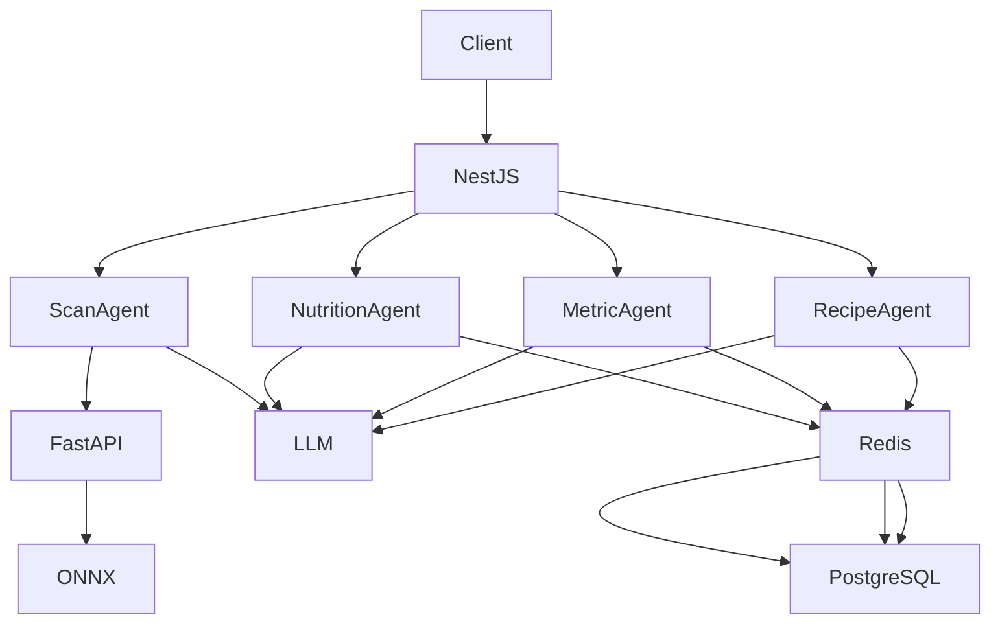
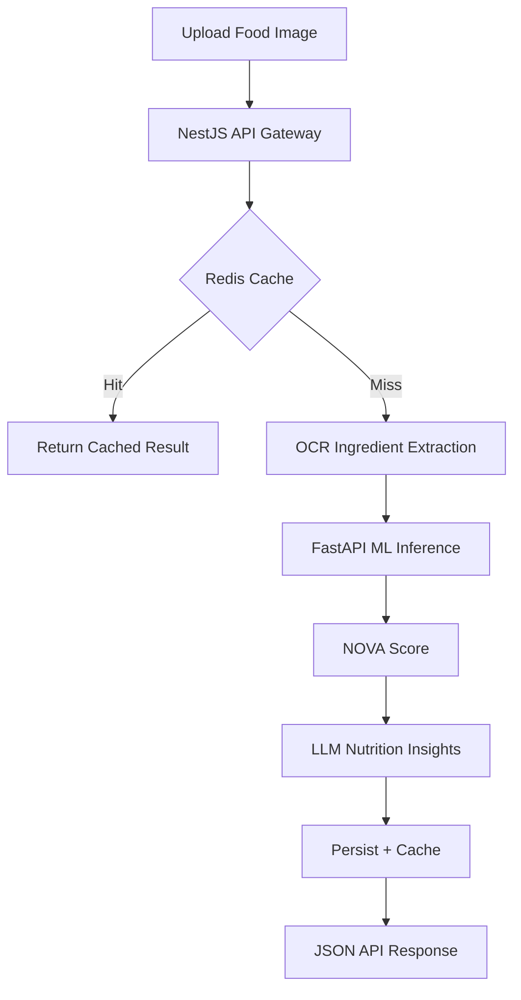

<!-- ================================================= -->
<!--                 NUTRIFY README                    -->
<!--   AI Nutrition • Food Label Scanner • NOVA AI     -->
<!-- ================================================= -->

<div align="center">

<h1>🥗 Nutrify AI Food Label Scanner & Clean Label API</h1>

<h3>
AI-powered nutrition analysis using OCR, BERT, and LLM agents  
</h3>

<p>
<strong>Keywords:</strong>
AI nutrition analysis · food label scanner · NOVA classification · clean label API · OCR ingredient extraction · BERT food classifier · FastAPI ML inference · NestJS backend
</p>

<p>
  <a href="https://nestjs.com/">
    
  </a>
  <a href="https://fastapi.tiangolo.com/">
    
  </a>
  <a href="https://www.docker.com/">
    
  </a>
  <a href="https://www.prisma.io/">
    
  </a>
</p>

</div>

---

## 🔍 What is Nutrify?

**Nutrify** is an **AI-powered food label analysis platform** that provides **clean-label transparency** using machine learning and AI engineering.

It allows users and developers to:
- Scan food labels from images
- Extract ingredient lists using OCR
- Classify foods by **NOVA processing levels (1–4)**
- Detect additives, allergens, and ultra-processed foods
- Generate clean-label recipes and meal plans

Nutrify is built as a **production-ready AI nutrition API** using **NestJS**, **FastAPI**, and a **fine-tuned DistilBERT model** deployed with **ONNX** for sub-second inference.

---

## 🚀 Key Features

- 📸 **Food Label OCR** — Extract ingredients from product images
- 🤖 **BERT-based NOVA Classification** — Accurate food processing level detection
- 🧠 **LLM-powered Nutrition Insights** — Gemini & OpenAI integration
- 🚨 **Allergy & Safety Alerts** — Real-time ingredient risk detection
- 🍳 **Clean-Label Recipes & Meal Planning**
- ⚡ **High-Performance Caching** — Redis + optimized PostgreSQL
- 🧩 **Microservice Architecture** — Scalable ML inference

---

## 🏗️ AI System Architecture
**The system operates as a microservices-based infrastructure, strictly decoupling high-speed ML inference from complex business logic.**


---
## 🔄 User Flow - Ingredient Scan & Classification

---
## 🤖 AI Agent Ecosystem

<details>
  <summary><strong>📸 Ingredient Scanner Agent</strong></summary>

  - OCR ingestion from images  
  - Ingredient normalization & parsing  
  - ML payload preparation  

</details>

<details>
  <summary><strong>🥗 Meal Planner Agent</strong></summary>

  - Personalized meal plans  
  - Macro & calorie-aware  
  - Allergy-safe generation  

</details>

<details>
  <summary><strong>🍳 Recipe Agent</strong></summary>

  - Clean-label alternatives  
  - Context-aware substitutions  
  - Ultra-processed food replacement  

</details>

<details>
  <summary><strong>🔥 Calories & Metrics Agent</strong></summary>

  - BMI & TDEE calculations  
  - Predictive calorie estimation  
  - Historical nutrition analytics  

</details>

<details>
  <summary><strong>🧠 BERT NOVA Engine</strong></summary>

  - Fine-tuned DistilBERT  
  - Quantized ONNX inference  
  - Semantic ingredient understanding  

</details>

---

## 🧬 Machine Learning & MLOps

- **Dataset:** 1GB+ Open Food Facts (Parquet)  
- **Feature Engineering:** DuckDB  

### Model Evolution
- Logistic Regression → DistilBERT Transformer  

### Optimization
- GPU training  
- ONNX quantization for CPU inference  

### Explainability Strategy
- BERT for deterministic scoring  
- LLMs only for non-deterministic reasoning  

---

## 🛠️ Tech Stack

### Backend (NestJS)
- TypeScript  
- Prisma ORM  
- JWT + Passport (Argon2)  
- Zod & Class-Validator  
- Redis caching  
- Circuit breakers & retries  

### ML Core (FastAPI)
- Python 3.11  
- ONNX Runtime  
- Pydantic  
- DuckDB analytics  

### Infrastructure
- PostgreSQL 17  
- Redis 7  
- Cloudinary  
- Docker & Docker Compose  

---
## 🚀 Quick Start

### 📊 ML Pipeline

#### Model Training
- **Data Engineering:** Processed 1GB+ Open Food Facts dataset using DuckDB  
- **Model Evolution:** Baseline Logistic Regression → Fine-tuned DistilBERT  
- **Training:** GPU acceleration via Google Colab  
- **Optimization:** ONNX quantization for sub-second inference  
- **Deployment:** Containerized FastAPI service with ONNX Runtime  

### 🧠 NOVA Classification Scale
- **Group 1:** Unprocessed / minimally processed foods  
- **Group 2:** Processed culinary ingredients  
- **Group 3:** Processed foods  
- **Group 4:** Ultra-processed foods  

---
### 1️⃣ Environment Setup

Create a `.env` file at the project root:

```env
# Database
POSTGRES_USER=user
POSTGRES_PASSWORD=password
POSTGRES_DB=nutrify_db
DATABASE_URL=postgresql://user:password@db:5432/nutrify_db
REDIS_HOST=redis

# AI Providers
GEMINI_API_KEY=your_key_here
OPENAI_API_KEY=your_key_here
LLM_PRIMARY_PROVIDER=GEMINI/OPENAI

# Services
ML_SERVICE_URL=http://ml-core:8000

# Media
CLOUDINARY_CLOUD_NAME=your_cloud_name
CLOUDINARY_API_KEY=your_api_key
CLOUDINARY_API_SECRET=your_api_secret

# Security
JWT_ACCESS_SECRET=super_secret
JWT_REFRESH_SECRET=refresh_secret
JWT_EXPIRATION=15m
JWT_REFRESH_EXPIRATION=7d

#Email
SMTP_USER=
SMTP_PASS=
SMTP_PORT=
SMTP_HOST=
```
### 2️⃣ Launch with Docker
```
# Build and start all services
docker-compose up --build

# Run in detached mode
docker-compose up -d

# View logs
docker-compose logs -f
```

### 3️⃣ Verify Services

- **API Service**: http://localhost:3000
- **ML Service**: http://localhost:8000
- **Health Check**: http://localhost:3000/health
---

### 📂 Services
```
API Gateway — services/api
- Scan orchestration
- User & auth management
- AI agents
- LLM coordination

ML Core — services/ml-core
- Food classification inference
- NOVA scoring and allergen dectection

```
---

<div align="center"> <strong>Built for performance, transparency, and real-world nutrition decisions.</strong> </div>